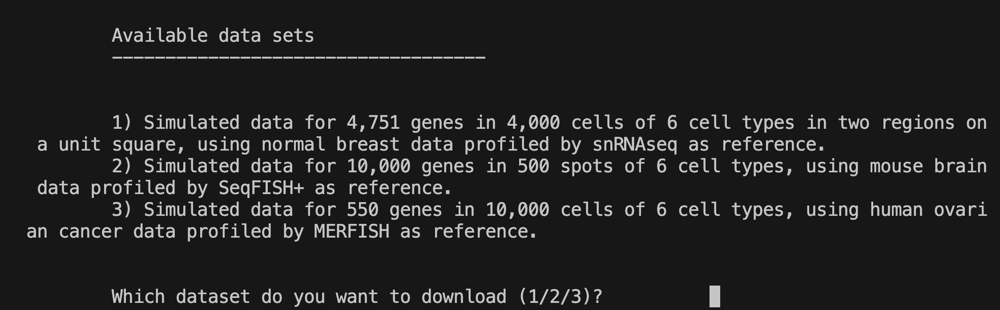
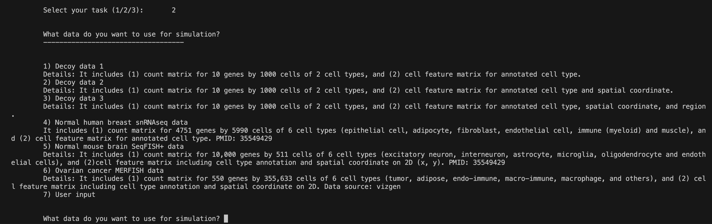
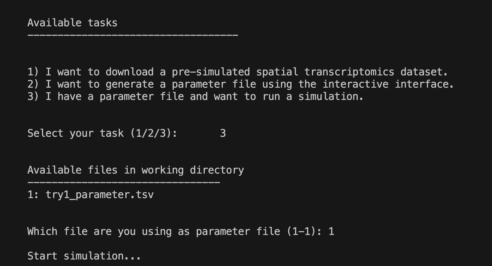

<!-- README.md is generated from README.Rmd. Please edit that file -->

# `STsimulator` for ‘de novo’ spatial patterns

## 1. Introduction

Existing Spatially Resolved Transcriptomics (SRT) data include limited
spatial patterns. `STsimulator` generates de novo spatial patterns using
snRNAseq or single-cell SRT as reference.

`STsimulator` provides both a R package for simulating SRT data and an
interface to guide users through task selection, parameter
specification, simulation, and documentation. `STsimulator` Docker

Reference: XS… ““.

## 2. Run `STsimulator` with an Interface on Docker

### Installation

1.  An installation of `Docker Desktop` is highly recommended,
    espeically for beginners. Docker can be downloaded at
    <https://www.docker.com>.

2.  `STsimulator` uses command line prompts, such as through `Terminal`
    in Mac. You might want to download your favorite software to run
    command line. My favorite is Visual Studio Code (`VSC`). If `VSC` is
    used, Docker needs to be installed in its Extension. I will use
    `VSC` for this tutorial.

<!-- 3. Clone `STsimulator` repository to your local machine, such as on `Terminal` type
```
git clone https://github.com/songxiaoyu/STsimulator
```
-->

### Run Docker

1.  Open Docker Desktop.

2.  On `VSC` terminal, pull image from the Docker Hub as follows:

<!-- -->

    docker pull songxiaoyu152/st_simulator_test 

3.  Run the Docker container directly with a working directory (WORKDIR)
    bound to your local machine. Note WORKDIR will be the location of
    all of your input data and your outputs.

<!-- -->

    docker run --mount type=bind,source="${WORKDIR}",target=/working_directory -it songxiaoyu152/st_simulator_test

My working directory is
“/Users/songxiaoyu152/Dropbox/SpatialTranscriptomics/Paper_Simulator/UseDocker”,
so this is my code:

    docker run --mount type=bind,source=/Users/songxiaoyu152/Dropbox/SpatialTranscriptomics/Paper_Simulator/UseDocker,target=/working_directory -it songxiaoyu152/st_simulator_test

4.  Now you enter an interactive interface that guides you through
    simulation. You can provide the interface with your choice of tasks,
    data, and parameters, and `STsimulator` will provide you simulated
    data, with parameters and documentations, saved in your working
    directory.

It includes three major types of tasks: 

#### Task 1: I want to download a pre-simulated spatial transcriptomics dataset.



If you select Task 1, `STsimulator` will provide you three pre-simulated
datasets. You can quickly check the data format and explore your
analyses before spending efforts on learning the package and simulating
data. These datasets are simulated based on normal breast snRNAseq,
mouse brain SeqFISH+, and human ovarian cancer MERFISH.

Here, select one example data and it will be downloaded to your working
directory.

#### Task 2: I want to generate a parameter file using command line prompts.

If you select Task 2, `STsimulator` will first walk you through a number
of parameter selection questions to help you generate a parameter file.
The first question is to select the data for simulation. Playing with
the decoy data may help you to get familiar with the simulator, while
spending little time on waiting for the simulation results. You can also
use our built-in real data by selection (4-6) or your input data by
selecting “user input”.  


#### Task 3: I have a parameter file and want to run a simulation.

Finally, you have the parameter file and can conduct the simulations.
Just tell `STsimulator` your parameter file, and it will provide you the
data and document you need! 

## 3. Run `STsimulator` with R package

While R docker with a user interface is attractive, experienced users
might like the flexibility of R pacakge for running specialized tasks.

You can install the latest version directly from GitHub with
[devtools](https://github.com/hadley/devtools):

``` r
install.packages("devtools")
devtools::install_github("songxiaoyu/STsimulator/RPackage")
library(STsimulator)
```

Assuming you already have a parameter file, you can run simulation (Task
3) using codes like these:

``` r
input="PathToParameterFile"
ParaSimulation(input=input)
```

Here are some of the tasks that might be interesting for experienced
users to use.

#### Task 1: Estimate Gaussian Copula.

Gaussian Copula can be put as input of the simulator for simulating
correlated genes.

``` r
# Assuming InputData has been downloaded 
load("InputData/cell_feature_data/snRNAseq_breast_cellfeature_033023.RData")
load("InputData/expression_data/snRNAseq_breast_expr_033023.RData")

CopulaEst=Est_GeneCopula(expr=expr, 
                         anno=cell_feature[,1], 
                         min_nonzero_num =3,
                         zp_cutoff=0.8, ncores=10)
save(CopulaEst, file="InputData/copula_data/snRNAseq_breast_Copula_033023.RData")
```

#### Task 2: Save the fitted gene expression models.

If one needs to run simulations multiple times on the same input data,
it might be a good idea to fit expression models once and save the
fitted models for use of multiple simulations. This strategy saves time
on model fitting in each simulation, but requires space and time for
data saving.

``` r
load("InputData/cell_feature_data/snRNAseq_breast_cellfeature_033023.RData")
load("InputData/expression_data/snRNAseq_breast_expr_033023.RData")

# Digest parameters
para=ParaDigest(input)
# Save fitted expression model for each gene
ModelFitFile=ParaFitExpr(para=para, 
                         expr=expr, 
                         feature=cell_feature,
                         CopulaEst=CopulaEst, ncores=10, save=T)
# Run simulation without the need for refitting the expression models.
ParaSimulation(input=input, ModelFitFile=ModelFitFile)
```

#### Task 3: Plot the spatial regions simulated by `STsimulator`.

``` r
win=RandomRegionWindow(nRegion=2, seed=123)
plot(win$window[[1]], col="pink")
plot(win$window[[2]], col="blue", add=T)
plot(win$window[[3]], col="orange", add=T)
```
